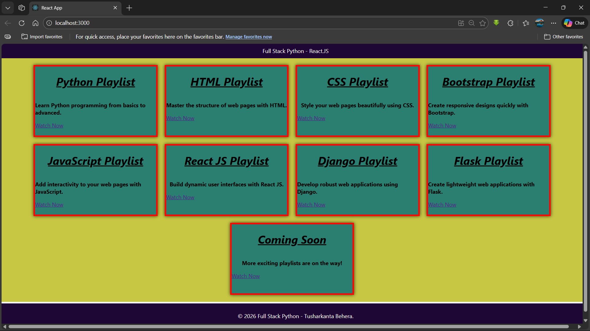

# Full Stack Python - ReactJS Tutorial Playlists

A modern and responsive React JS application that showcases various programming tutorial playlists. This website displays curated learning resources for Full Stack Python development, including Python, HTML, CSS, JavaScript, React JS, Django, Flask, and more.

## 🖼️ Project Screenshot



> **Note:** Add your project screenshot as `screenshot.png` in the root directory to display it here.

## ✨ Features

- **Responsive Card Layout**: Beautiful card-based design that adapts to different screen sizes
- **Multiple Technology Playlists**: Curated playlists for Python, HTML, CSS, Bootstrap, JavaScript, React JS, Django, and Flask
- **Interactive UI**: Clean and modern user interface with hover effects
- **Direct Links**: Each card links directly to YouTube playlists for easy access
- **Reusable Components**: Built with modular React components (Navbar, Card, Footer)

## 🛠️ Technologies Used

- **React JS**: Frontend library for building user interfaces
- **JavaScript (ES6+)**: Modern JavaScript features
- **CSS3**: Styling and animations
- **HTML5**: Markup structure

## 📋 Prerequisites

Before running this project, make sure you have the following installed:

- **Node.js** (v14 or higher)
- **npm** (Node Package Manager)

## 🚀 Installation & Setup

1. **Clone the repository**

   ```bash
   git clone https://github.com/tusharkanta-behera/react-project1.git
   cd project1
   ```

2. **Install dependencies**

   ```bash
   npm install
   ```

3. **Start the development server**

   ```bash
   npm start
   ```

4. **Open in browser**
   - The app will automatically open at [http://localhost:3000](http://localhost:3000)
   - If it doesn't open automatically, manually navigate to the URL

## 📁 Project Structure

```
project1/
├── public/
│   ├── index.html
│   ├── manifest.json
│   └── robots.txt
├── src/
│   ├── Components/
│   │   ├── Card.js          # Reusable card component
│   │   ├── Navbar.js        # Navigation bar component
│   │   └── Footer.js        # Footer component
│   ├── App.js               # Main application component
│   ├── App.css              # Application styles
│   ├── index.js             # Entry point
│   └── index.css            # Global styles
├── package.json
└── README.md
```

## 🎯 Available Playlists

The application features the following tutorial playlists:

1. **Python Playlist** - Learn Python programming from basics to advanced
2. **HTML Playlist** - Master the structure of web pages
3. **CSS Playlist** - Style your web pages beautifully
4. **Bootstrap Playlist** - Create responsive designs quickly
5. **JavaScript Playlist** - Add interactivity to your web pages
6. **React JS Playlist** - Build dynamic user interfaces
7. **Django Playlist** - Develop robust web applications
8. **Flask Playlist** - Create lightweight web applications
9. **Coming Soon** - More exciting playlists on the way!

## 🔧 Available Scripts

### `npm start`

Runs the app in development mode. Open [http://localhost:3000](http://localhost:3000) to view it in your browser.

### `npm test`

Launches the test runner in interactive watch mode.

### `npm run build`

Builds the app for production to the `build` folder. It correctly bundles React in production mode and optimizes the build for the best performance.

## 📸 Adding Your Screenshot

To add your project screenshot:

1. Take a screenshot of your running application
2. Save it as `screenshot.png` in the project root directory
3. Commit and push the image to your repository

## 👨‍💻 Author

**Tusharkanta Behera**

## 📄 License

This project is open source and available under the [MIT License](LICENSE).

## 🤝 Contributing

Contributions, issues, and feature requests are welcome! Feel free to check the issues page.

## ⭐ Show your support

Give a ⭐️ if you like this project!

### Analyzing the Bundle Size

This section has moved here: [https://facebook.github.io/create-react-app/docs/analyzing-the-bundle-size](https://facebook.github.io/create-react-app/docs/analyzing-the-bundle-size)

### Making a Progressive Web App

This section has moved here: [https://facebook.github.io/create-react-app/docs/making-a-progressive-web-app](https://facebook.github.io/create-react-app/docs/making-a-progressive-web-app)

### Advanced Configuration

This section has moved here: [https://facebook.github.io/create-react-app/docs/advanced-configuration](https://facebook.github.io/create-react-app/docs/advanced-configuration)

### Deployment

This section has moved here: [https://facebook.github.io/create-react-app/docs/deployment](https://facebook.github.io/create-react-app/docs/deployment)

### `npm run build` fails to minify

This section has moved here: [https://facebook.github.io/create-react-app/docs/troubleshooting#npm-run-build-fails-to-minify](https://facebook.github.io/create-react-app/docs/troubleshooting#npm-run-build-fails-to-minify)
